# Using the Column Description Report 
 
A reference guide to tables and columns within Counterpoint 
 
_Updated: December 16, 2025_ 

--- 
 
## Table of Contents 
- [Quick Start](#quick-start)
- [Overview of the Counterpoint Table Structure](#overview-of-the-counterpoint-table-structure)
- [Common Table Prefixes](#common-table-prefixes)
- [Finding a Table from the User Interface](#finding-a-table-from-the-user-interface)
- [Accessing and Configuring the Column Description Report](#accessing-and-configuring-the-column-description-report)
- [Generating and Interpreting the Report](#generating-and-interpreting-the-report)
- [Understanding Lookup Fields and Keys](#understanding-lookup-fields-and-keys)
 
--- 
 
## Quick Start 
 
Follow these steps to get useful results quickly: 
 
1. Open **System > Utilities > Column Description Report**. 
2. Click the **Tables** icon and select a single table to start with (for example, **AR_CUST**). 
3. Click the **Report** icon and enable all **table options** and **column options**, and add the following to the **selected columns** list: 
   - Display label 
   - Is key 
   - Is required 
   - Mapping values 
   - Default value 
4. (Optional) Add lookup-related columns if you need to understand relationships to other tables. 
5. Click the **Lightning** icon to generate the report. 
 
Start with one table and minimal options to avoid overwhelming output. You can always re-run the report with additional selections once you know what information is needed. 
 
--- 
 
## Overview of the Counterpoint Table Structure 
 
Before using the Column Description Report, it helps to understand how Counterpoint organizes its database. Tables are grouped by functional area and identified by a short prefix. These prefixes make it easier to recognize what type of data a table contains. 
 
## Common Table Prefixes 
 
Below is a quick reference for the most commonly used table prefixes: 
 
| Prefix | Description |
|-------|-------------|
| AR | Customer-related tables (originally Accounts Receivable) |
| DM | Data Mark tables, typically used for aggregated reporting data |
| DX | Data migration tables created by NCR, originally for CP v7 migrations |
| IM | Item and inventory tables |
| PO | Purchasing-related tables (purchase orders, receiving, vendors, adjustments) |
| PS | Point-of-sale tables (tickets, sales orders, drawers, stations, stores, voids) |
| SY | System tables (company control, users, workgroups, distributions, gift cards, store credit) |
| USER | Custom tables created by Rapid (not standard NCR tables) |
| VI | Database views |
 
---
 
## Finding a Table from the User Interface 
 
If you are unsure which table backs a specific Counterpoint window: 
 
1. Open the desired window in Counterpoint 
2. Right-click the header bar 
3. Select **Table Information** 
 
The Table Information dialog displays the table name used by that window. 
 
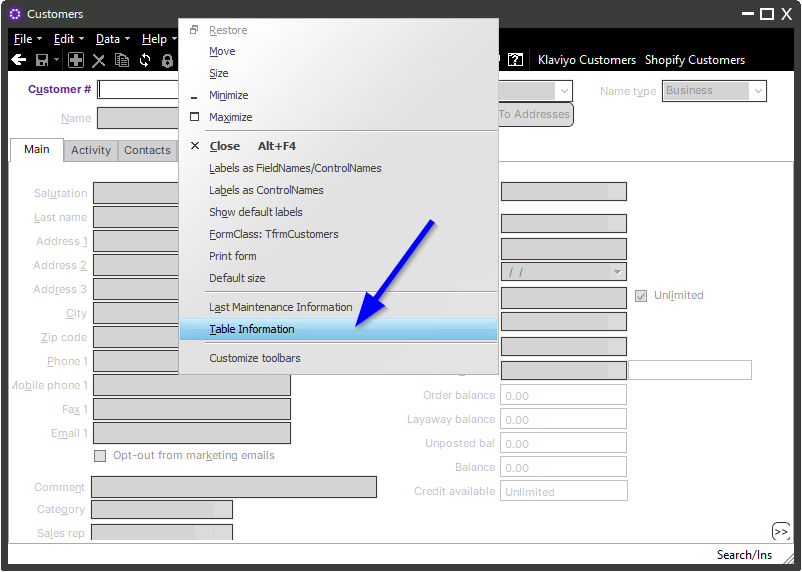 
 
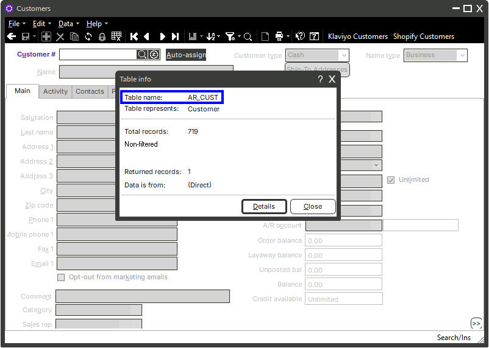 
 
--- 
 
## Accessing and Configuring the Column Description Report 
 
To open the Column Description Report, navigate to **System > Utilities > Column Description Report**. 
 
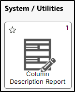 
 
### Selecting Tables 
 
Use the **Tables** icon to select one or more tables to include in the report. 
 
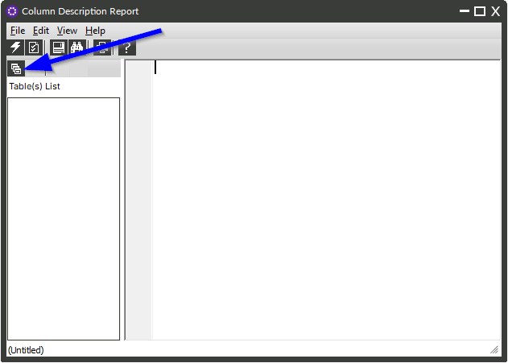 
 
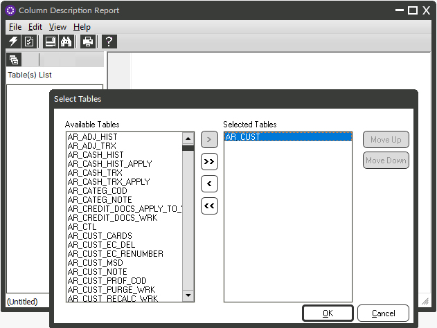 
 
### Configuring Report Options 
 
Use the **Report** icon to configure which columns and details are included. 
 
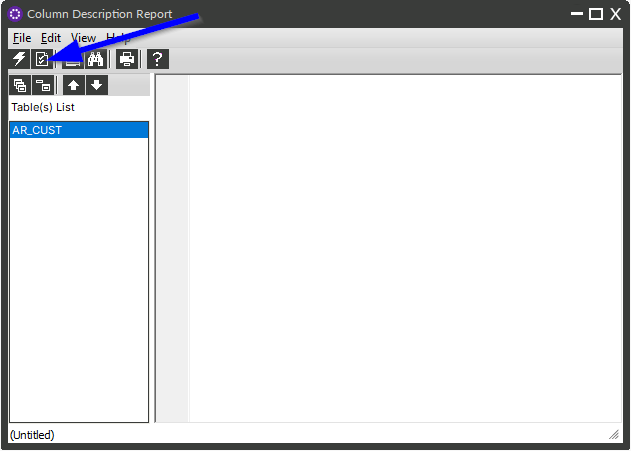 
 
For new users, it is recommended to start with a minimal set of options and columns to avoid overly verbose output. 
 
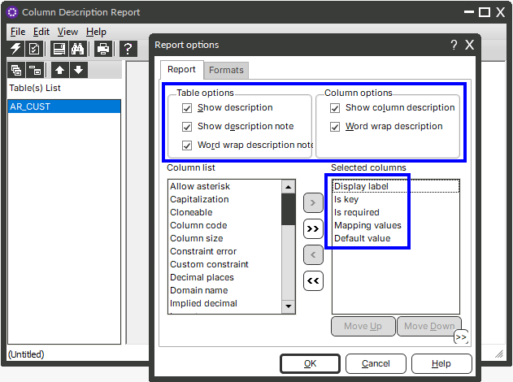 
 
---
 
## Generating and Interpreting the Report 
 
After selecting the table(s) and configuring report options, click the **Lightning** icon to generate the report. 
 
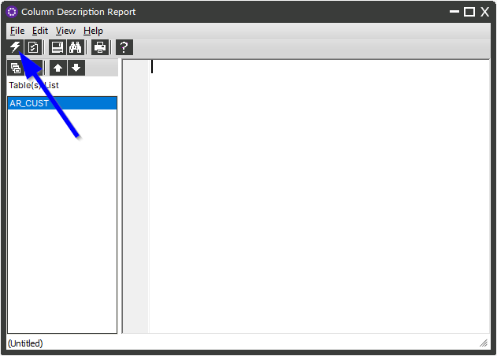 
 
### Example Output 
 
Below is an example report generated for the **AR_CUST** table: 
 
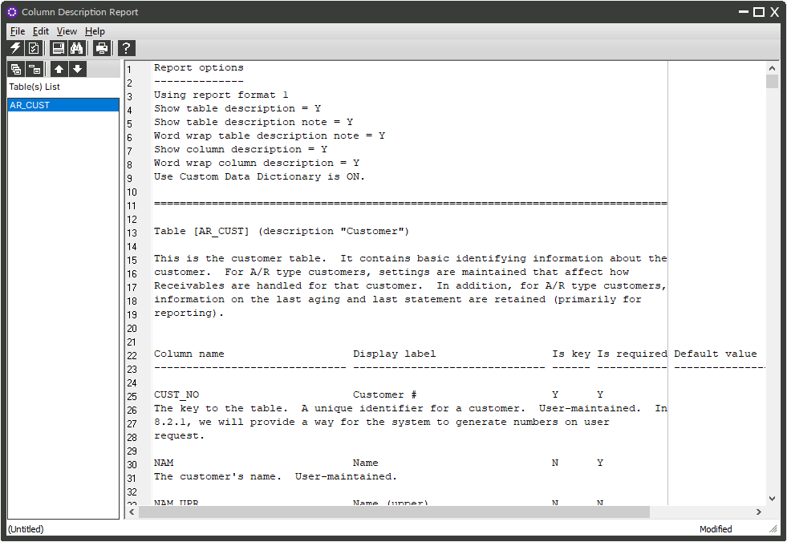 
 
### Reducing Report Verbosity 
 
If the report output is too detailed, disable **Show Column Description** in the report options. 
 
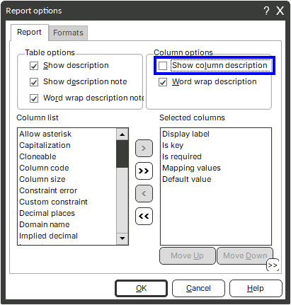 
 
---
 
## Understanding Lookup Fields and Keys 
 
To identify whether a field references another table, include the lookup-related columns in the report options. 
 
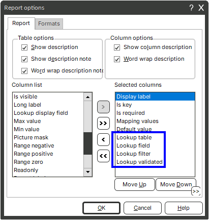 
 
### Lookup Example 
 
In the **AR_CUST** table: 
 
- The **Sales Rep** field is required 
- It is *not* a key field 
- Valid values are pulled from the **SY_USR** lookup table. 
- Specifically, the **USR_ID** field is filtered where **Is Sales Rep = Yes** 
 
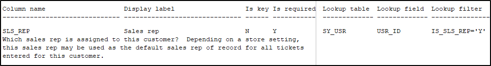 
 
### Keys 
 
A **key** is a unique identifier for a record. 
 
- Some tables use a single-column key 
- Other tables use a composite key made up of multiple columns 

For example, sales orders are uniquely identified by a combination of **Store** and **Order Number**.  
